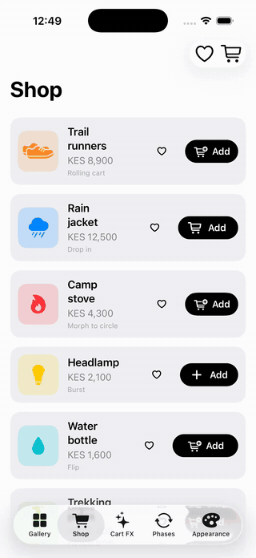
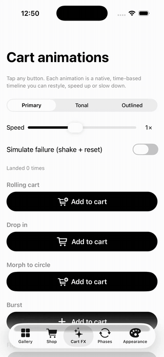
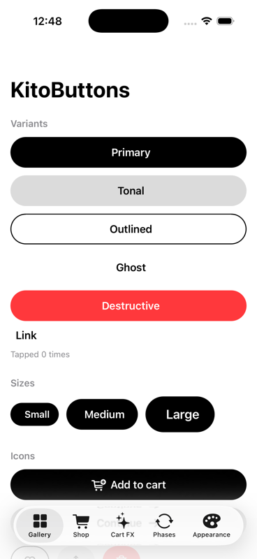
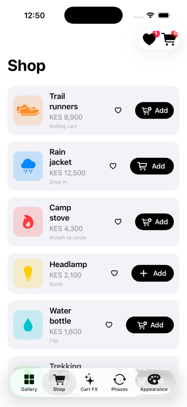
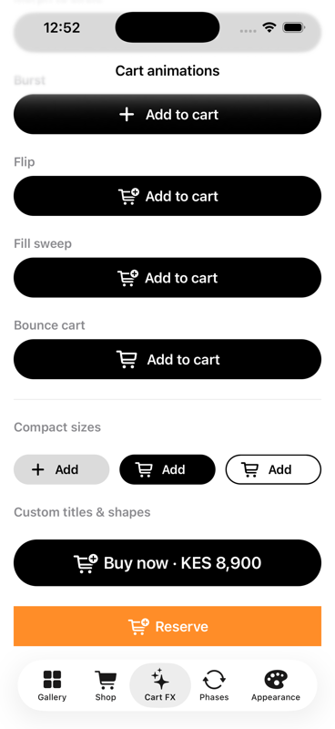
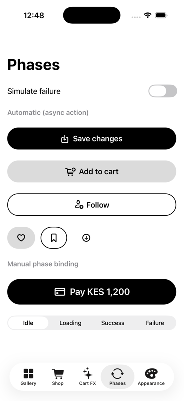

# KitoButtons

A comprehensive, themeable SwiftUI button toolkit: six variants, three sizes, icons, loading / success / failure phases with icon morphing, seven choreographed add-to-cart animations, fly-to-cart flights, async actions, per-button theme overrides, and a native `ButtonStyle` you can drop onto any existing `Button`.

- iOS 15+, macOS 12+, tvOS 15+, watchOS 8+, visionOS 1+; pure SwiftUI, no dependencies
- Author: **Wycliff Njenga**
- Licence: MIT

<p align="center">
  
  
</p>

<p align="center">
  
  
  
  
</p>

## Installation

### Swift Package Manager (recommended)

**In Xcode**

1. File ▸ Add Package Dependencies…
2. Paste `https://github.com/wykeenjenga/KitoButtons.git`
3. Dependency rule: *Up to Next Major Version* from `1.5.0`
4. Add the `KitoButtons` product to your app target

**In `Package.swift`**

```swift
dependencies: [
    .package(url: "https://github.com/wykeenjenga/KitoButtons.git", from: "1.5.0")
],
targets: [
    .target(name: "MyApp", dependencies: ["KitoButtons"])
]
```

### CocoaPods

```ruby
pod 'KitoButtons', '~> 1.4'
```

Then `pod install` and open the `.xcworkspace`.

### Import

```swift
import KitoButtons
```

### Requirements

| | Minimum |
| --- | --- |
| iOS | 15.0 |
| macOS | 12.0 |
| tvOS | 15.0 |
| watchOS | 8.0 |
| visionOS | 1.0 |
| Swift | 5.9 |
| Xcode | 15 |

The one-line default look is a black capsule (white in dark mode). Change it once at the root of your app with `.kitoButtonTheme(...)`.

## Quick start

```swift
KitoButton("Continue", systemImage: "arrow.right", iconPlacement: .trailing) {
    await submit()            // spinner shows and the button disables until this returns
}
.fullWidth()
.size(.large)
.disabled(!formIsValid)
```

## Variants and sizes

```swift
KitoButton("Primary") {}                     // solid brand fill (default)
KitoButton("Tonal") {}.variant(.tonal)       // soft tinted fill
KitoButton("Outlined") {}.variant(.outlined)
KitoButton("Ghost") {}.variant(.ghost)       // text only, tint on press
KitoButton("Delete") {}.variant(.destructive)
KitoButton("Learn more") {}.variant(.link)

.size(.small) / .size(.medium) / .size(.large)
.size(.custom(height: 52, font: .system(size: 15, weight: .semibold), horizontalPadding: 20, iconSize: 16))
```

## Icons

```swift
KitoButton("Add to cart", systemImage: "cart.badge.plus") {}
KitoButton("Next", systemImage: "arrow.right", iconPlacement: .trailing) {}
KitoButton("Pay", image: Image("mpesa")) {}
KitoButton(systemImage: "heart", accessibilityLabel: "Like") {}   // icon-only, square
```

## State

```swift
.loading(isSaving)       // controlled spinner; async actions manage this automatically
.disabled(true)          // dims via theme.disabledOpacity
.role(.destructive)      // semantic role, also switches to the destructive variant
.haptics(false)
```

## Theme

Defaults: capsule shape, black primary fill (white in dark mode) with system-background text.
Presets: `KitoButtonTheme.default`, `.black` (always black), `.accent` (uses your accent color).

```swift
.kitoButtonTheme { theme in
    theme.tint = .indigo
    theme.onTint = .white
    theme.shape = .rounded                      // .rectangle / .roundedRectangle(cornerRadius:) / .capsule (default)
    theme.borderWidth = 1.5
    theme.shadow = KitoButtonShadow()
    theme.pressedScale = 0.97
    theme.loadingBackground = Color(.systemGray3)   // fill while loading; spinner uses loadingForeground
    theme.loadingForeground = .white
    theme.underlinesLink = true                     // underline the .link variant (iOS 16+)
    theme.overrides[.primary] = KitoButtonColors(background: .black, foreground: .yellow)
}
```

Set it once at the root of your app and override per screen or per button.

## Phases: loading → tick / shake

Async actions drive a `KitoButtonPhase` automatically. Opt into result feedback and the icon morphs
from its idle glyph to a checkmark (or shakes with a cross when the action throws), then returns to idle.

```swift
KitoButton("Add to cart", systemImage: "cart.badge.plus") {
    try await cart.add(product)
}
.showsResult()                                    // success and failure feedback
.successTitle("Added")                            // optional title swap
.resultIcons(success: "cart.fill.badge.plus")     // optional glyphs

KitoButton("Pay") {}.phase($phase)                // or drive the phase yourself
```

## Add-to-cart animations

`KitoCartButton` plays a choreographed, Lottie-style timeline natively. Pick one of seven built-in
styles; each is time-based, so it plays identically however long your network call takes.

| Style | What happens |
| --- | --- |
| `.rollingCart` | Label slides away, a cart rolls in, the product drops into it, the cart rolls off, "Added ✓" appears |
| `.dropIn` | The product falls into the cart icon, the cart squashes and bounces, a dot badge pops |
| `.morphCircle` | Button squeezes into a circle with a spinner, a tick draws with a particle burst, the button expands back |
| `.burst` | Plus spins into a tick while particles fly outward |
| `.flip` | The button flips over in 3D to reveal the added state |
| `.fillSweep` | Success colour sweeps across, the tick draws itself |
| `.bounceCart` | Cart jumps, a plus falls in, the cart wiggles, a "1" badge pops |

```swift
KitoCartButton("Add to cart", animation: .rollingCart) {
    try await cart.add(product)          // throwing = shake and reset
}
.addedTitle("Added")
.variant(.primary).size(.medium).fullWidth()
.duration(1.6).hold(1.0)                 // timeline length and how long "Added" stays
.onAdded { cart.count += 1 }             // fires at the landing moment
.flies(to: "cart", with: flights) { Image(product.image) }
```

Building blocks are public if you want your own choreography: `KitoCheckmarkShape` (trim to draw),
`KitoBurst` (particles), `KitoArcEffect` (arc motion), `KitoEase` (segment/easing helpers).

## Fly to cart

```swift
@StateObject var flights = KitoFlightController()

NavigationStack { list }
    .kitoFlightLayer(flights)                     // hosts the in-flight items
    .toolbar {
        KitoBadgeButton(systemImage: "cart", count: cart.count) { showCart = true }
            .accessibilityLabel("Shopping cart")   // VoiceOver announces this, not "cart"
            .bounces(on: flights.landings(on: "cart"))
            .kitoFlightAnchor("cart")             // the target
    }

KitoButton("Add", systemImage: "cart.badge.plus") { try await cart.add(product) }
    .showsResult()
    .flies(to: "cart", with: flights) { Image(product.image) }   // arcs from the button to the cart
```

Any view can be a source or target with `.kitoFlightAnchor(id)`, and you can launch a flight from
code with `flights.fly(from: "product-1", to: "cart") { ... }`. `KitoArcEffect` is public if you
want the arc motion elsewhere.

## Motion presets

All timings live in `KitoButtonTheme.motion` (`KitoButtonMotion`), exposed as computed presets:

```swift
.kitoButtonTheme { $0.motion = .lively }          // .default / .lively / .subtle
.kitoButtonTheme { $0.motion.resultDuration = 2 } // or tune one curve
```

Helpers: `.kitoButtonBounce(trigger:)` pops a view when a value changes (badges), `.kitoButtonShake(trigger:)` shakes it.

When the system **Reduce Motion** setting is on, everything degrades gracefully: `KitoButtonMotion.subtle` timings, no press scale, no shake or bounce, cart buttons crossfade to their added state instead of playing the choreography, and flights land instantly.

## Localization

The strings KitoButtons produces itself (default "Add to cart" / "Added" titles, loading and result
accessibility values, badge counts) ship in English, Swahili and French. Override or add languages:

```swift
KitoButtonsLocalization.provider = { key, english in NSLocalizedString("kito.\(key)", value: english, comment: "") }
```

## Use on a plain SwiftUI Button

```swift
Button("Save") { save() }
    .buttonStyle(.kito(.outlined, size: .medium, fullWidth: true))
```

## Example app

`Example/KitoButtonsExample.xcodeproj` (in this repository) has four tabs: a gallery of every variant, size and state; a **Shop** with add-to-cart flights, a bouncing cart badge and heart-to-favourites flights; **Phases** showing automatic and manual loading/success/failure; and a live appearance and motion switcher. Regenerate the project with `xcodegen generate` after editing `Example/project.yml`.

## Contributing

KitoButtons is open source and open to contributions. The short version:

1. **Open an issue** describing the bug or the feature you would like.
2. **Fork and branch** from `main`, make the change with tests and a screenshot or GIF for UI work.
3. **Open a pull request** referencing the issue. CI runs the tests, the iOS example build and the podspec lint.
4. Once **approved**, a maintainer merges it and it ships in the next release.

See [CONTRIBUTING.md](CONTRIBUTING.md) for details, and the issue templates for what to include.

## Support the project

If KitoButtons saved you time, you can buy me a coffee. It keeps the packages maintained and the example apps growing.

<a href="https://www.buymeacoffee.com/wycliffnjea"></a>

## License

MIT. See [LICENSE](LICENSE). Made by Wycliff Njenga in Nairobi.
